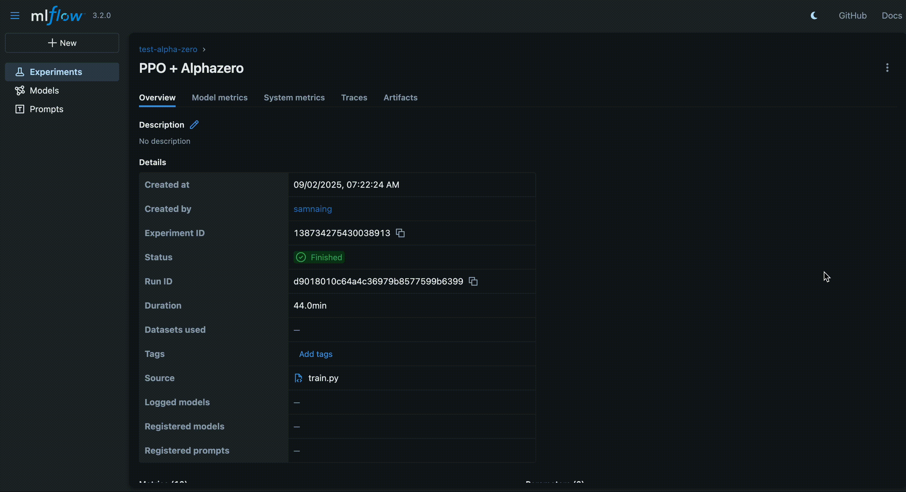
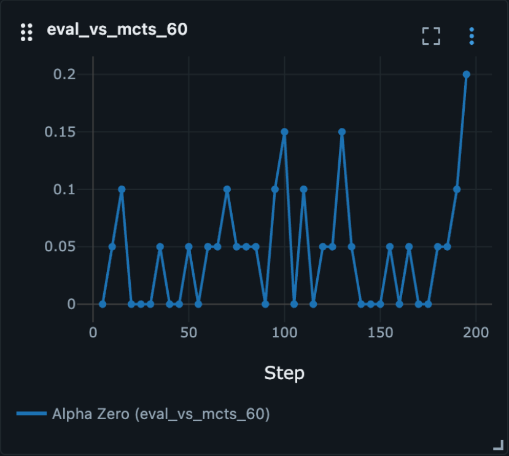
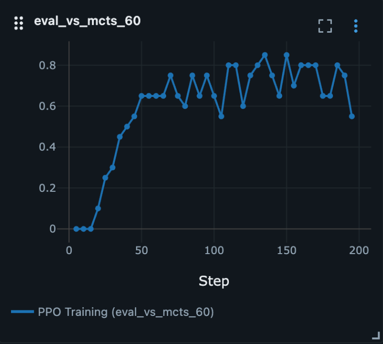
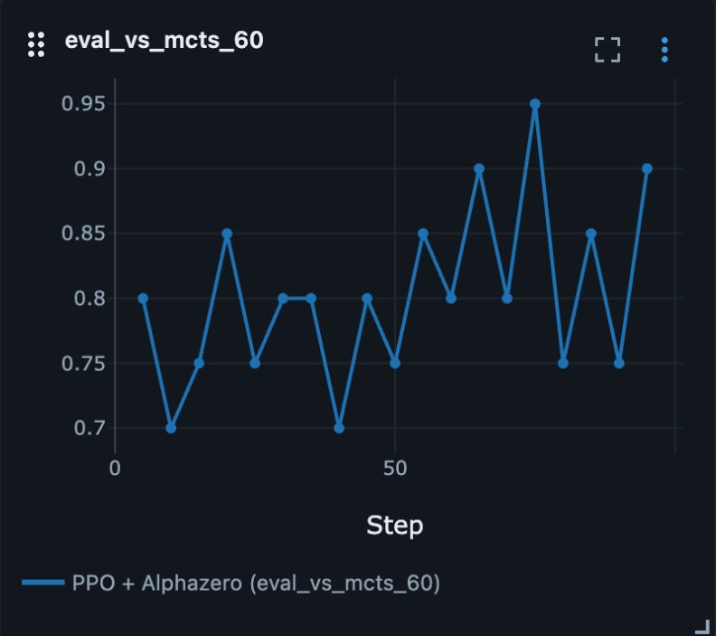

# Hex 5x5: AlphaZero and PPO


## 🎯 What's This All About?

So I got curious about how AlphaZero actually works and decided to build it from scratch for Hex 5x5. Along the way, I ended up comparing it with PPO and discovered some pretty interesting stuff about transfer learning in RL.

Here's what I wanted to figure out:

- **How does AlphaZero really work?** Built the full pipeline - MCTS, neural networks, self-play, the works
- **What's the deal with rewards and learning?** Wanted to see how AlphaZero learns through self-play and how rewards propagate in a simpler game
- **AlphaZero vs PPO - who wins?** Direct showdown between search-based learning and policy gradients
- **Can we make AlphaZero learn faster?** Testing if PPO pre-training can give AlphaZero a head start

Hex 5x5 turned out to be perfect for this - complex enough to be interesting, simple enough that I could actually understand what was happening!

## 📊 MLFlow - Because I Like Pretty Graphs

Used MLflow to track everything because, let's be honest, half the fun is watching those training curves go up (hopefully).



### Getting MLflow Running

```bash
# Jump into the project
cd hex-alphazero-project

# Start MLFlow server
mlflow server

# Check out http://localhost:5000
```

_[GIF coming soon: MLflow dashboard doing its thing]_

## 🛠️ Getting Started

Everything's set up with `uv` because it's fast and I'm impatient:

```bash
# Install requirements
uv install

# Train
cd algorithm
python train.py

# Run the web app
cd app
docker compose up -d
```

## 🧪 The Experiments - Where Things Got Interesting

### Round 1: Pure AlphaZero Training

**Plot twist**: Training AlphaZero from scratch was way harder than expected! It could barely beat basic MCTS with 60 simulations, which was... humbling.

**What I learned**:

- Hex 5x5 might be too simple for AlphaZero to really shine (it was designed for Chess and Go, after all)
- Self-play has this weird chicken-and-egg problem - if your model sucks at the start, it learns from... well, sucky play
- AlphaZero needs serious patience to get past the "random moves everywhere" phase



### Round 2: PPO to the Rescue

**Mind blown**: PPO absolutely crushed it! Within just a few epochs, it was beating MCTS(60) like it was nothing.

**Why PPO was so much faster**:

- **No search overhead**: Just direct policy optimization, no expensive tree searches
- **Sample efficient**: Gets more learning done per game
- **Stable**: None of that early self-play randomness drama

This made me realize that for simpler games, maybe we've been overthinking things with all that search complexity.



### Round 3: The Transfer Learning Experiment

**Game changer**: I loaded the PPO weights into AlphaZero and wow - it learned so much faster!

**The magic happened because**:

- **No cold start**: Started with a decent policy instead of random garbage
- **Faster convergence**: AlphaZero could focus on refining strategy instead of learning basics
- **Proof of concept**: Confirmed that AlphaZero's slowness is mostly about bad initialization

**The bigger picture**: While the improvements on Hex 5x5 were cool, imagine what this could do for really complex games where AlphaZero's search power actually matters!



## 🏆 Tournament Time - Who's the Best?

Ran a full tournament to see who actually wins when push comes to shove:

```bash
# Generate Eval
cd eval
python gen_eval.py
```

| Rank | Model          | Win Rate | Games | Elo Rating |
| ---- | -------------- | -------- | ----- | ---------- |
| 1    | AlphaZero(20)  | 0.829    | 70    | 1710       |
| 2    | AlphaZero(60)  | 0.800    | 70    | 1601       |
| 3    | AlphaZero(100) | 0.771    | 70    | 1549       |
| 4    | MCTS(100)      | 0.500    | 50    | 1410       |
| 5    | MCTS(60)       | 0.480    | 50    | 1378       |
| 6    | MCTS(20)       | 0.400    | 50    | 1319       |
| 7    | PPO            | 0.171    | 70    | 1255       |
| 8    | Random         | 0.014    | 70    | 979        |

**Some cool observations**:

- AlphaZero eventually dominated, even after all that training drama
- Weirdly, AlphaZero(20) beat AlphaZero(100) - sometimes less is more?
- PPO trained fast but couldn't match fully trained AlphaZero's strategic depth

## 🤔 What I Learned

1. **Pick the right tool**: Simple games might not need the full AlphaZero treatment
2. **Transfer learning rocks**: Pre-training can seriously speed up complex algorithms
3. **Self-play is tricky**: That bootstrapping problem is real and needs to be planned for
4. **Evaluation matters**: Tournament results tell a much richer story than simple win rates

## 🚀 What's Next?

- Try bigger Hex boards (7x7, 9x9) where AlphaZero might really show its strength
- Play around with curriculum learning to make training smoother
- Test other transfer combos (maybe A3C → AlphaZero?)
- Build a web interface so people can actually play against these models

---

_This was a fun project that taught me way more than I expected about the nuances of RL algorithms. Sometimes the best way to understand something is to build it yourself and watch it struggle (and eventually succeed)!_
